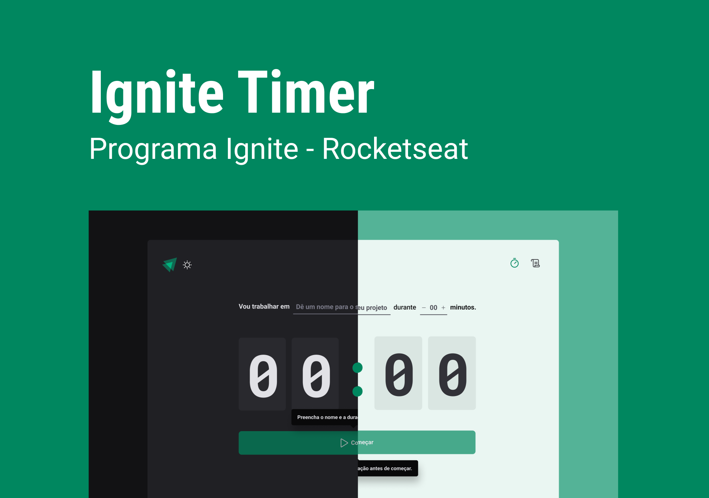

<p>
    
</p>

## :computer: Projeto

Ignite Timer é um projeto para se aplicar a técnica de Pomodoro, que consiste em se tornar mais produtivo em qualquer coisa que precisar. Basicamente consiste em trabalhar naquilo por determinado tempo e dando pausas, mas nesse tempo em que estiver trabalhando, tem de se manter 100% focado, e o tempo de pausa deve ser usado para descanso.

## :rocket: Tecnologias

Foram usadas as seguintes tecnologias:

- [React](https://pt-br.reactjs.org)
- [React Hook Form](react-hook-form.com)
- [Zod](https://zod.dev)
- [immer](https://immerjs.github.io/immer/)

## :bulb: Alguns dos novos conhecimentos adquiridos

1. immer - Para trabalhar com dados imutáveis de uma forma mais simples com javascript

```js
const nextState = produce(baseState, (draft) => {
  draft[1].done = true;
  draft.push({ title: "Tweet about it" });
});
/*
- o baseState é o valor que eu quero modificar
- o draft é o rascunho, então eu posso fazer as minhas alterações
*/
```

2. useReducer - Armazena informações que são mais complexas e quando as alterações de um estado são custosas e dependem do estado na sua versão anterior, acaba se tornando uma forma mais simples de se trabalhar

```js
const [cycles, dispatchCycles] = useReducer(
  (state: Cycle[], action: any) => {
    return state;
  },
  [],
  () => {}
);

/*
- 1º é o state

- 2º é o valor inicial do meu state

- 3º parâmetro do useReducer é uma função que é executada assim que o reducer é criado, 
para recuperar os dados do reducer de algum outro local
*/
```
